  

<h1 align="center">Engineering With Purpose</h1>

  Third-year engineering student at the National Higher Polytechnic Institute of Bamenda (NAHPI).

  I build useful web experiences, practical tools, and cybersecurity projects. I’ve studied the programming languages I use to build, and vibe coding helps me turn ideas into working prototypes while I keep learning and refining the code.

<table align="center">
  <tr>
    <td><strong>Frontend</strong> Next.js · React · TypeScript · JavaScript · Tailwind CSS</td>
    <td><strong>Backend & Data</strong> Node.js · Express · PostgreSQL · SQLite · Prisma</td>
  </tr>
  <tr>
    <td><strong>Systems & Security</strong> Linux · C · Kernel modules · Nmap · HTB</td>
    <td><strong>Building & Exploring</strong> Vibe coding · rapid prototyping · web apps · security labs</td>
  </tr>
</table>

  

  

<h3>Web projects</h3>

- [Vantage Logistics](https://github.com/TopsUchiha/vantage) — shipment tracking, map view, and admin workflows.
- [BBQ Smokerz](https://github.com/TopsUchiha/bbq-smokerz) — e-commerce concept with a product catalog and admin tools.
- [Havanese Adoption &amp; Rescue](https://github.com/TopsUchiha/Havanese) — adoption listings and an Express/SQLite admin backend.
- [MCQ Grader](https://github.com/TopsUchiha/MCQ_GRADER) · [Livestream](https://github.com/TopsUchiha/Livestream) — practical tools and app experiments.

  

<h3>Systems &amp; security projects</h3>

- [Linux Loadable Kernel Module](https://github.com/TopsUchiha/Linux-Loadable-Kernel-Module-LKM-Development) — a C kernel module and Linux build practice.
- [Bandit Wargame Practice](https://github.com/TopsUchiha/bandit-wargame-practice) — OverTheWire exercises, commands, and notes.
- [Cybersecurity Journey](https://github.com/TopsUchiha/Cybersecurity-Journey-) — my hands-on learning log.

<h2>Where I Am Now</h2>

- Completed the **Hack The Box Linux Path**.
- Working through the **Hack The Box Pentester Path**, currently focusing on **Nmap** and network reconnaissance.
- Studying web security with **PortSwigger Web Security Academy**.
- After pentesting and web pentesting, I plan to explore **cloud security** and **AI security**.
- I use vibe coding to move quickly from an idea to a working prototype, drawing on the languages I’ve studied and continuing to improve my implementation skills.

  <a href="https://github.com/TopsUchiha">GitHub: @TopsUchiha</a>

<i>Curious by nature. Building one project and one skill at a time.</i>

